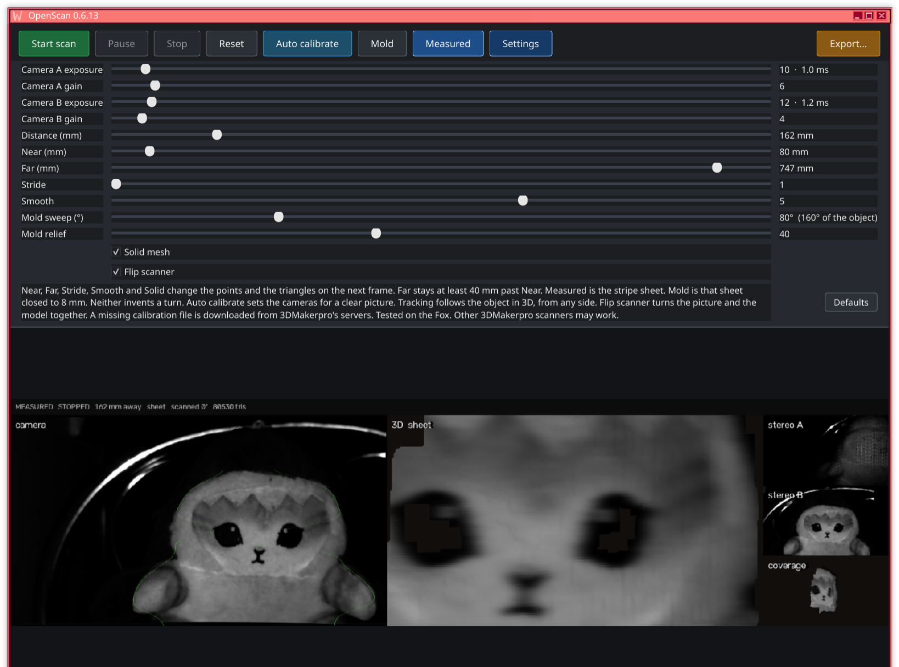

# OpenScan



OpenScan 0.6.14 is a personal scanner tool. It was vibe-coded for one job. It is not actively maintained, and it is not a product.

Use your own assistant and tailor the code to what you need.

## What it does, and what it does not

Mold wraps the camera outline into a solid. With Mold sweep at 60, a front view covers 120° of that solid. At 80 it covers 160°. Mold relief turns the photo into bumps on that shape. Measured keeps that outline as a flat sheet.

The window shows the clean camera, the 3D solid, the pattern camera, the clean camera again, and a side view. Export opens the system save dialog and writes STL, OBJ, or PLY from the file name. A still picture does not add another shell. A turn is taken from the top of the outline, so a centered spin of a round object can still be missed. A full circle is not guaranteed.

One USB camera pair was used. Other scanners are untested. There is no factory calibration in this tree. You bring `calib/<serial>.txt` for your own unit.

OpenScan is not affiliated with, endorsed by, or sponsored by any scanner maker. Names of those products belong to their owners. Their installers and apps are not included here, and must not be redistributed with this project.

`openscan --version` prints the version. The notes are in [CHANGELOG.md](CHANGELOG.md). The software is MIT licensed. See [LICENSE](LICENSE).

The cameras are ordinary USB Video Class devices. The kernel driver is `uvcvideo`. This project is the userspace program. It does not install a kernel module.

## Dependencies

The Linux build was tried on CachyOS. Windows and macOS use the system camera and window calls instead of libX11 and libjpeg.

### Build tools

| Package | Tested | Role |
| --- | --- | --- |
| CMake | 4.4.3 | Generate the build. Minimum 3.16. |
| GCC | 16.2.1 | C11. The program is C. |

### Libraries

| Host | Linked for the window and the cameras | Role |
| --- | --- | --- |
| Linux | libX11, libjpeg | The window, and camera JPEG. |
| Windows | Win32, Media Foundation, WIC | The window, the two cameras, and JPEG. No extra JPEG library. |
| macOS | Cocoa, AVFoundation, ImageIO | The window, the two cameras, and JPEG. |

The program is C. A factory-file lookup runs the `curl` program only when you set a local key and the file is missing. A calibration file you already have is enough to scan.

### System

| Requirement | Role |
| --- | --- |
| Linux `uvcvideo` | Both Fox cameras already bind to this kernel driver. |
| Video4Linux2 (`linux/videodev2.h`) | Capture. Headers come with the C library. |
| Membership of group `video` | Open `/dev/video*` for capture. |
| udev rule in `udev/99-openscan.rules` | Optional. Names the nodes `/dev/openscan-a` and `/dev/openscan-b` and lets the `video` group open them. |

### Arch and CachyOS

```bash
sudo pacman -S cmake gcc libx11 libjpeg-turbo
```

Windows, from Linux, with the MinGW cross compiler installed:

```bash
cmake -S . -B build-win -DCMAKE_TOOLCHAIN_FILE=packaging/mingw-w64.cmake
cmake --build build-win
```

On Windows itself, the same `cmake -S . -B build` with MinGW or MSVC. macOS uses the same command and links Cocoa and AVFoundation. `openscan --version` prints the host (`linux`, `windows`, or `mac`).

### What is not required

No vendor installer, account, or browser cookie is required to build or run OpenScan.

## Build

`build/` and `dist/` are generated. They are listed in `.gitignore` and are not part of the source tree.

### Linux program

From this directory:

```bash
cmake -S . -B build
cmake --build build
```

The program is `build/openscan`. The engine is `build/libopenscan.a`. A program that wants the scanner without the window includes `openscan/openscan.h` and links that library.

```bash
./build/openscan help
./build/openscan devices
./build/openscan turn-test
```

### Small package

`build/openscan` is the program. Camera access still needs the `video` group.

```bash
./packaging/appimage.sh
```

That writes `dist/OpenScan-<version>-x86_64.tar.gz`. Unpacking it creates one folder. Open a terminal there and run `./openscan`. The folder also contains `README.txt` with those steps. `AppRun` starts the same program.

### Android APK

The Android app is `android/`. It compiles the same C sources. The native library links `log` and `android`.

You need JDK 17, the Android SDK, NDK `28.2.13676358`, and CMake `3.22.1`. `android/local.properties` is not committed. It only needs:

```text
sdk.dir=/path/to/Android/Sdk
```

From `android/`:

```bash
export JAVA_HOME=/path/to/jdk-17
./gradlew :app:assembleDebug
```

The APK is `android/app/build/outputs/apk/debug/app-debug.apk`. Copy it to `dist/OpenScan-0.6.14.apk` if you want it next to the AppImage. That directory is gitignored.

Install on a phone with `adb install -r dist/OpenScan-0.6.14.apk`. The application id is `dev.lab.openscan`.

## Use

Plug in the Fox and start:

```bash
./build/openscan
```

The window opens idle. The settings row is exposure, gain, distance, near, far, stride, smooth, mold sweep, and mold relief, plus Mold, Measured, Auto calibrate, and Export. Under that, the camera is on the left, the 3D view is in the middle, and stereo A, stereo B, and the side view are on the right. Drag the 3D view to turn it. Start begins the mold. Stop holds it. Reset clears it. `q` or Esc quits. On quit, the model is written as `openscan-last.stl`, `openscan-last.obj`, and `openscan-last.ply`.

Turn the object. The status line shows triangle count and degrees. A front view covers twice the mold sweep (160° at the default of 80). A real turn adds to that when the outline moves.

Closing the window quits.

### Command line

```text
openscan                         window
openscan devices                 the camera pair
openscan grab -o DIR             camA.pgm and camB.pgm
openscan scan -o object.stl --seconds 8
openscan turn-test
openscan help
```

`scan` records without a window. `--shape mold` is the solid. `--shape measured` is the sheet. `--distance` is 100–500 mm. `--sweep 80` covers 160° of the object from the front. Exposure flags are `--exposure-a`, `--gain-a`, `--exposure-b`, and `--gain-b`.

Export opens the system save dialog. The suggested name is `openscan-last.stl`. Pick the folder and the name there; `.stl`, `.obj`, or `.ply` selects the format. The saved path stays on the status line. `scan -o` uses the suffix the same way.

Exposure is the UVC absolute exposure in units of 100 microseconds. If the camera API cannot turn manual exposure off, the status line says the sliders were not applied and the camera stays on auto. Gain is 0..100, the value written to the camera. Android's camera API uses that same number when the sensor's ISO range covers 0..100. Otherwise 0 is the bottom of that range and 100 is the top. A useful starting point on this Fox is camera A exposure 22 gain 6, camera B exposure 16 gain 4.

## Calibration

Each scanner has its own calibration file, `calib/<serial>.txt`. The serial is read from the camera. This repository does not include one.

Search order:

1. `calib/<serial>.txt` in the current directory
2. `calib/<serial>.txt` next to the sources
3. `$XDG_DATA_HOME/openscan/calib/<serial>.txt`, or `~/.local/share/openscan/calib/<serial>.txt`

A vendor lookup runs only when you set `OPENSCAN_CALIB_SIGN` or `calib/sign.local` yourself. That key is not in the source tree. If it is unset, OpenScan stops and you place the file yourself. A calibration file is never uploaded.

Both camera names have to carry the same serial. A mixed pair is not opened, and a factory file is used only when its DevID is that serial. A path passed with `--calib` is loaded as given.

Android reads the serial from the same `KYT Camera A/B` name and keeps the pair only when both names have that serial. When that name is hidden, it reads the USB serial on the same two cameras and still requires both. It uses the file already stored for that serial, then a shipped asset of that name, then the same two servers. A connected unit is not scanned with a different serial's file. If Android blocks those video devices, the camera API is used only when both Fox USB cameras share the loaded serial. A camera id that names a Fox video node is that camera, even if another camera is also connected. That named pair uses camera A as the pattern camera unless Swap is on. The button reads Swapped while that exchange is on, including the next time the app opens. Opaque ids are used only when they are the only pair and no other USB camera is plugged in, and those still choose the pattern by which picture has more contrast, then Swap. The camera API streams only at the calibration size. A different size is not stretched over the factory intrinsics. Frames must already be that size. A different picture is not scaled. Both images are required. One image is not scanned. A loaded pair is measured only after a scanner's calibration is loaded, and the status line names that serial. The shipped file is not used to measure pictures while no scanner has been seen. A device that streams isochronous video without the video class still counts as another camera. With no Fox plugged in, other cameras stay closed.

Exported meshes do not contain the serial number or the calibration text.

## USB names

Install the udev rule if you want stable device names:

```bash
sudo install -m 0644 udev/99-openscan.rules /etc/udev/rules.d/99-openscan.rules
sudo udevadm control --reload
sudo udevadm trigger --subsystem-match=usb --attr-match=idVendor=0c45
sudo udevadm trigger --subsystem-match=video4linux
```

After that, the capture nodes are `/dev/openscan-a` and `/dev/openscan-b`. Your user must be in group `video`.

## Layout

| Path | Contents |
| --- | --- |
| `include/openscan/` | Camera, calibration, and the live session. |
| `src/device/` | Cameras. Video4Linux on Linux, Media Foundation on Windows, AVFoundation on macOS. |
| `src/calib/` | Read a calibration file. Lookup, when a local key is set, calls the `curl` program. |
| `src/live/` | Mold sweep, turn, mesh, preview. This part is plain C. |
| `src/ui/` | The same window loop. X11, Win32, or Cocoa draws it. |
| `android/` | Android app. The scan engine is the C in this tree. |
| `calib/` | Where you put your own calibration file. None is committed. |
| `udev/` | Device naming rule. |

More of the daily operation is in [docs/usage.md](docs/usage.md).
